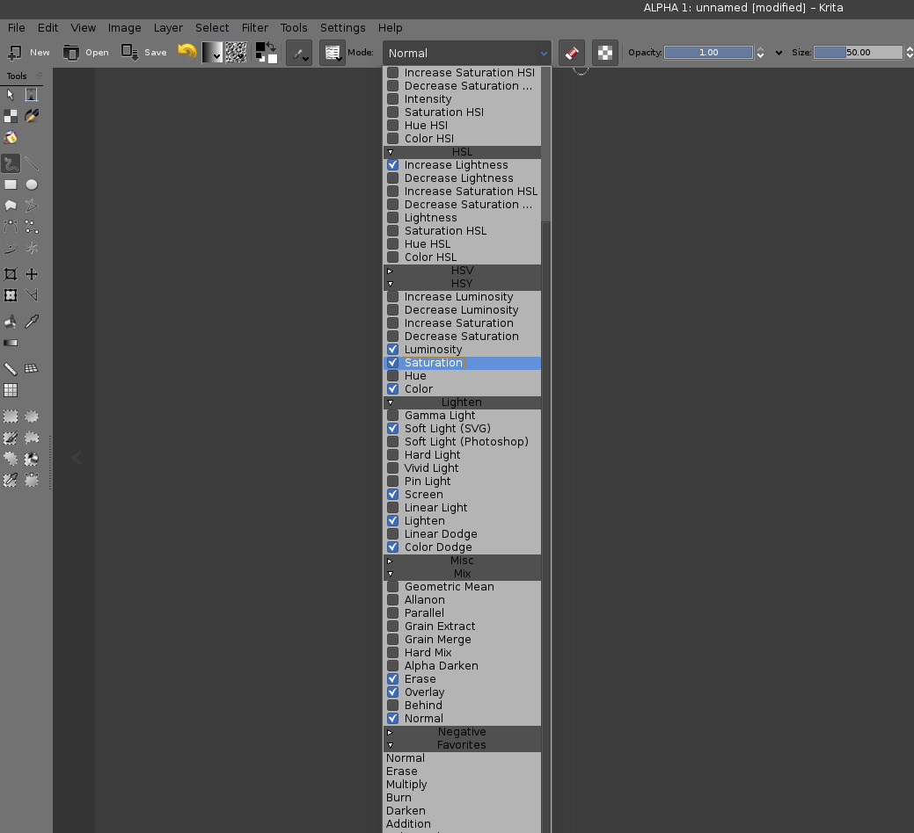
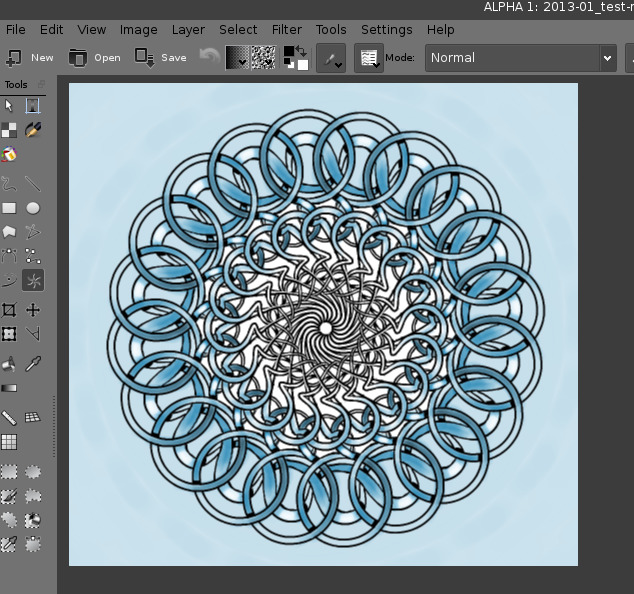
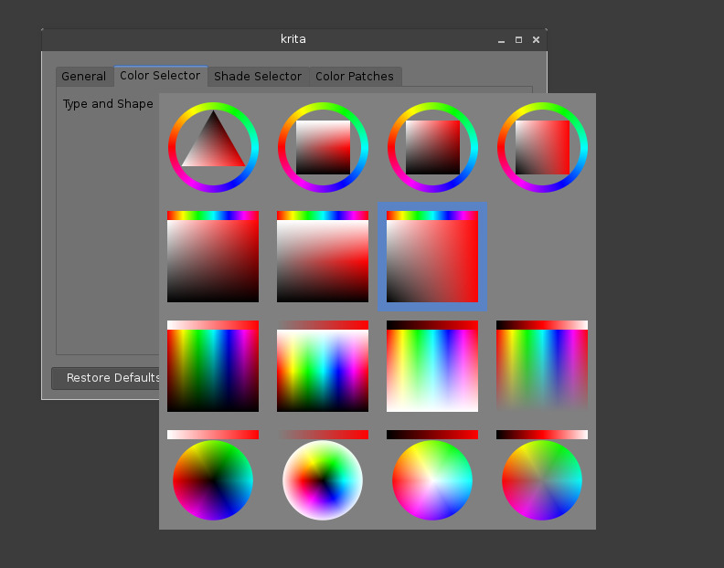

---
title:
- type: main
  text: Introduction to Krita for PhotoShop Users
creator:
- role: author
  text: David Revoy <davidrevoy@gmail.com>
- role: author
  text: Inge Wallin <inge.wallin@kogmbh.com>
- role: contributor
	text: Wolthera van Hövell tot Westerflier <griffinvalley@gmail.com>
identifier:
- scheme: DOI
  text: doi:10.234234.234/33
publisher:  ---
rights: ---
language: en
stylesheet: krita-style.css
...

# Introduction to Krita for PhotoShop Users #
David Revoy <davidrevoy@gmail.com>
Inge Wallin <inge.wallin@kogmbh.com>

## Introduction ##
This document gives an introduction to Krita for users who have been using PhotoShop. The intention is to make you productive in Krita as fast as possible and ease the conversion of old habits into new ones.
This introduction is written with Krita version 2.9 and Photoshop CS2 and CS3 in mind. But even though things may change in the future, the basics will most likely remain the same.
The first thing to remember is that Krita is a 2D paint application while Photoshop (PS) is an image manipulation program. This means that PS has more features than Krita in general but Krita has the tools that are relevant to digital painting. When you get used to Krita you will find that Krita has some features that are not part of PS.

## Krita Basics ##
This chapter covers how you use Krita in the basic operations compared to PS.

### View and Display ####

#### Navigation ####
In Krita you can navigate your document using all these methods:

1. **Mouse wheel**: roll down and up for zoom, and press it down to pan your document.
2. **Keyboard**: with + and - on your numpad keyboard, and pan with space
3. As in Photoshop, Painter, Manga Studio: Ctrl+space to zoom, and space to pan. 
   Note:  if you add  Alt and so do a  Ctrl+Alt+Space you’ll have a discrete zoom.

#### Rotation ####
Rotate the canvas with Shift+Space, or ctrl+[ and ctrl+] or with 4 or 6. Reset the rotation with 5.

#### Mirror ####
Press m to see your drawing or painting mirrored in the viewport.

#### Move and Transform ####
Moving and Transformation of contents is done using tools into Krita. You can then find them in the toolbar. 
If you are familiar with the way to move layers in PS by holding down Ctrl, you can do the same in Krita by pressing the T key for the move tool (think ‘T’ranslate) or Ctrl+T for transform tool.
Press ‘B’ to go back to the brush tool when the transformation or translation is done.
To find how to make advanced deformations using the ‘Transform’ tool, do not right-click on the on-canvas widget: all the option are in the ‘Tool Options’ docker. 
Change can be applied with ‘Enter’ for the Transform tool. 
*Note: Move tool changes are auto-applied.* 

### Selections ###
Unlike in PS, you cannot use Alt or Shift during a selection to remove or add selection to the active selection. 
Instead Krita offer sub tools for this, and you can select them in the Tool Option if a select tool is active. These sub tools are represented as icons.
You can switch to those sub modes by pressing:

- R to replace selection
- T to [^1]intersect
- A to add to the selection (this is the one you will want to use often)
- S to subtract from the selection (the other one popular)
Note: You also cannot press Ctrl to move the content of the selection (you have to press ‘T’ or select the ‘Move Tool’). 
Some other tips:
- If you want to convert a layer to a selection (to select the visible pixels), right-click on the layer docker, and choose ‘select opaque’. 
- If you use a polygonal selection tool, or a selection which needs to be ‘closed’, you will be able to do it or by using a double-click, or by using a ‘Shift-click’. 
You cannot move a selection, but you can scale them. To do this, choose Select > Scale  (Note: also, in the Select menu there are more classical option to grow, shrink, feather, border, etc...)
- Ctrl + H: Show / Hide selection (same shortcut)
- Ctrl + A: Select All
- Note: Ctrl + Shift + A: deselect All (and not Ctrl+D as in PS) 

Note for Gimp user: Krita auto-expands and auto defloats new layers created from a selection after a Ctrl+C, Ctrl+V so you do not have to worry about not being able to paint outside the pasted element. 

[^1]: This doesn't work as intended right now. Intersect is a selection mode which uses 'T' as the shortcut. However 'T' is also used to switch to the 'Move tool' so this shortcut is not functional right now. You have to use the button on the Tool Options.

### Layer Handling ###
The most common shortcuts are almost the same:

- Ctrl + J: duplicate
- Ctrl + E: flatten
- Note: Ctrl + Shift + E: flattens all (not Ctrl+Shift+M as in PS) 
- ‘insert’: insert a new paint layer

#### Groups and Blending Mode (Composite Mode): ####
The group blending mode in Krita has priority over child layers and overrides it. This can be surprising for PS users. On PS you can use groups to just clean your layer stack and keep blending mode of your layer compositing through all the stack.  In Krita the compositing will happen at first level inside the group, then taking into account the blending mode of the group itself.
Both system have pros and cons. Krita’s way is more predictable according to some artists,  compositing-wise. The PS way leads to a cleaner and better ordered layer stack visually wise. 

#### Multi Layer Transform or Move ####
You can select multiple layers on the stack by holding down Shift as in PS, and if you move the layer inside a group you can move or transform the whole group - including doing selection on the group and cut all the sub layers inside on the fly.  You can not apply filters to group to affect multiple layers. 

#### Clipping Masks ####
Krita has no clipping mask, but there is a workaround involving layer groups and ‘inherit alpha’ (see the alpha icon). Place a layer with the shape you want to clip the other with at the bottom of a group and layers above with the ‘inherit alpha’ option. This will create the same effect as the “clipping mask” PS feature. 

#### Pass-through mode ####
This is availeble in Krita, but not implemented as a blending mode. Rather, it is an option next to ‘inherit alpha’ on group layers.

#### Smart Layers ####
Instead of having smart layer that you can do non-destructive transforms on, Krita has the following set of functionality:

File Layers
:	These are layers which point to an outside file, and will get automatically updated if the outside file changes.

Clone Layers
:	These are layers that are an ‘instance’ of the layer you had selected when creating them. They get updated automatically when the original layer updates.

Transform Masks
:	These can be used to non-destructive transform all layer types, including the file and clone layers.

Filter Masks
:	Like adjustment layers, these can apply filters non-destructively to all layer types, including file and clone layers.

#### Layerstyles ####
You can apply photoshop layerstyles in Krita by rightclicking any given layertype and selecting ‘layerstyle’ from the rightclick menu. Krita can open and save ASL files, but not all layerstyle functionality is there yet.

#### Other ####
Layers and groups can be exported. See the ‘Layer’ top menu for this and many other options. 

*Note: Krita has at least 5 times more blending modes than PS. They are sorted by categories in the drop down menu. you can use the checkbox to add your most used to the Favorite categories.* 

### Paint tools ###
This is Krita's strong point. There are many many paint tools and they have a lot of options.

#### Tools ####
In Krita, there is a totally different paradigm for defining what ‘tools’ are compared to PS. Unlike in PS, you will not find the brush, eraser, clone, blur tool, etc.
Instead you will find the *way to trace* your strokes on the canvas: freehand, line, rectangle, circle, multiple brush, etc. When you have selected the ‘way to trace’ you can choose the *way to paint*: erasing / cloning / blurring, etc are all part of  *way it paint* managed by the brush-engines options. These brush engine options are saved into so called *presets*, which you can find on ‘Brush presets’. 
You can fine tune, and build your own presets using the ‘Edit Brush Settings’ icon on the top tool bar. 

#### Erasing ####
In Krita, the eraser is not a tool, it is a Blending mode (or Composite mode). You can change each brush you have to erase by pressing ‘E’. By pressing ‘E’ again you’ll be back to the last blending mode you had selected before pressing 'E' the first time.

#### Useful shortcut ####

- Shift:  Grow or Shrink the brush size (or [ and ]).
- /: Switch last preset selected and current (ex: a pencil preset, and a eraser preset).
- K and L:  increment Darker and Lighter value of active color
- I and O: increment opacity plus or minus.
- D: Reset color to black/foreground and white/background
- X: Switch background and foreground colors
- Shift+ I / Shift+N / Shift+M: a set of default keyboard shortcuts[^2] for accessing the on-canvas color selector.

[^2]:Some people regard these shortcuts as somewhat unfortunate. The reason is that they are meant to be used during painting and left-shift is at the opposite end of the keyboard from I, M and N. So for a right-handed painter, this is very difficult to do while using the stylus with a right hand. Note that you can reassign any shortcut by using the shortcut configurator in Settings -> Configure Shortcuts.

#### Stabilization / Path Smoothing ####
Using the freehand ‘paint with brush’ tool that you can find on the Tool Options, more settings for smoothing the path and stabilization of  your brush strokes are available.

#### Global pressure curve ####
If you find the feeling of Krita too hard or too soft regarding the pressure when you paint, you can set a softer or harder curve here: Settings > Configure Krita > Tablet settings

#### Adjustment ####
Like in PS, you can use the classic filters to adjust many things while painting:

- Ctrl+L : Levels 
- Ctrl+U: HSV adjustment
- Ctrl+i: Invert

#### Dodge / Burn / Blur Tools ####
Unlike Photoshop, where these are seperate tools, in Krita, they are availeble via the Filter Brush Engine, which allows you to apply the majority of Krita's filters in brush form.

#### Themes ####
If you don’t like the dark default theme of Krita go to: Settings > Themes, and choose a brighter or darker theme.
If you don’t like the color outside your viewport go to: Settings > Configure Krita > Display, and change the Canvas border color. 

## What Krita Has Over Photoshop ##
As mentioned in the introduction, Krita is a specialized paint application. Therefore it also has many specialized tools for painting which are not found in more generalized image manipulation applications such as PS. Here is a short list of the most important ones.

### Brush Engines ###
Krita has a lot of different so called brush engines. These brush engines define various methods on how the pixels end up on your canvas. Brush engines with names like Grid, Particles, Sketch and others will bring you new experiences on how the  brushes work and a new landscape of possible results. You can start customising brushes by using the brush-settings editor, which is accesible via the toolbar, but it's much easier to just press ‘F5’.

### The Pop-up Palette ###
Easily to be found on ‘Rightclick’, the pop-up palette allows you to quickly access brushes, a color history and a color selector within arm's reach. The brushes are determined by tag, and pressing the lower-right configure button calls a dropdown to change tags. This allows you to tag brushes in the preset docker by workflow, and quickly access the right brushes for the workflow you need for your image.

### Transformations ###
The Krita transformation tool can perform transformations on a group and affect children layers. There's several modes, like free, perspective, warp, the powerful cage and even liquefy.
Furthermore, you can use transformation masks to apply transforms non-destrutively to any layer type, raster, vector group, you name it.

To watch : http://youtu.be/kgTkfebleCE, http://youtu.be/mTKXnMHE8Co

### Incremental Save ###
You can save your artwork with the pattern : myartworksname_001.kra , myartworksname_002.kra, myartworksname_003.kra  etc, by pressing a single key on the keyboard. Krita will do the incrementation of the final number if the pattern “_XXX” is recognized at the end of the file's name.

This feature allows you to avoid overwriting your files, and keep track to your older version and work in progress steps. 

### Color to alpha Filter ###
If you want to delete the white of the paper from a scanned artwork , you can use this filter. It takes a color and turns it into pure transparency. 

### Many Blending Modes ###
If you like using blending modes, Krita has a large number of them - over 70! You have plenty of room for experimentation. 
A special system of favourite blending modes has been created to let you have fast access to the ones you use the most.  
 

### Painting Assistants ###
Krita has many painting assistantsThis is a special type vector shapes with a magnetic influence on your brush strokes. You can use them as rulers, but with other shapes than just straight

### Multibrushes: Symmetry / Parallel / Mirrored / Snowflake ###
Krita's multibrush tool allows you to paint with multiple brushes at the same time. Movements of the brushes other than the main brush is created by mirroring what you paint, or duplicating it by any number around any axis. They can also be used in parallel mode.

### A Wide Variety of Color Selectors ###
The 'advanced color selector' docker offer you a wide choice of color selectors. 

### View dependant colorfilters ###
Using the lut docker, Krita allows tou to have a seperate color correction filter per view. While this is certainly useful to people who do color correction in daily life, to the artist this allows for seeing a copy of the image in luminance grayscale, so that they instantly know the values of the image.

### HDR color painting ###
This same LUT docker is the controller for painting with HDR colors. Using the LUT docker to change the exposure on the view, Krita allows you to paint with HDR colors, and has native open exr support!

## What Krita Does Not Have ##
Again, Krita is a digital paint application and PS is an image manipulation program with some painting features. This means that there are things you can do in PS that you cannot do in Krita. This section gives a short list of these features.

### Filters ###
Krita has a pretty impressive pack of filters available, but you will probably miss one or two of the special filters or color adjustment tools you use often in Photoshop. For example, there is no possibility to tweak a specific color in HSV adjustment.

### Automatic healing tool ###
Krita does not have an automatic healing tool. It does, however, have a so called clone tool which can be used to do healing although not automatically.

### Macro Recording ###
Macro recording and playback exists in Krita, but it is not working well at this time.

### Text Tool ###
The text tool in Krita is less advanced than the similar tool in Photoshop.

### Blending Modes While Transforming ###
When you transform a layer or a selection in Krita, the transformation appears on the top of your layer stack ignoring the layer blending mode. 

### Other ###
Also, you cannot move selections, nor ‘Export for web’, ‘Image Ready’ for Gif frame or slicing web image, etc

## Conclusion ##
Using these tips you will probably be up to speed with Krita in a short time. If you find other things worth mentioning in this document we, the authors, would be interested in hearing about them. 
Krita is developing fast so we believe that the list of things possible in PS but not in Krita will become shorter in time. We will maintain this document as this happens.
